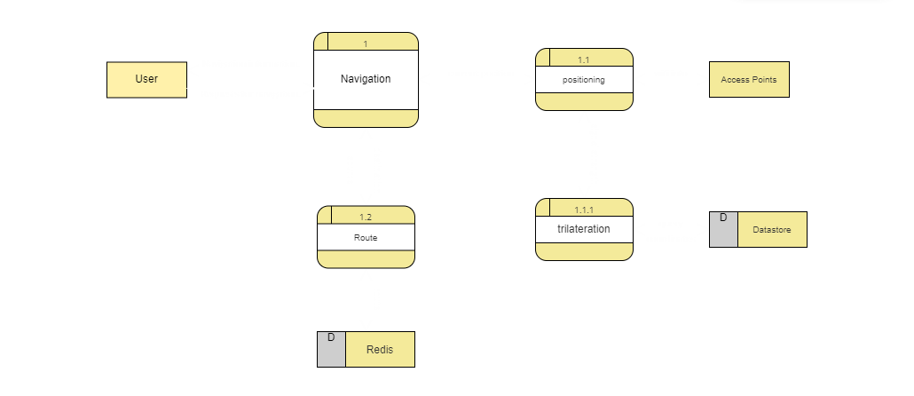

# System Requirements Specification (_SRS_)

## Table of Contents

- [System Requirements Specification (_SRS_)](#system-requirements-specification-srs)
  - [Table of Contents](#table-of-contents)
  - [1. Introduction ](#1-introduction-)
    - [1.1 Purpose of the Document](#11-purpose-of-the-document)
    - [1.2 Overview of the System](#12-overview-of-the-system)
  - [2. Overall Description ](#2-overall-description-)
    - [2.1 Product Perspective](#21-product-perspective)
    - [2.2 Product Functions](#22-product-functions)
    - [2.3 User Classes and Characteristics](#23-user-classes-and-characteristics)
    - [2.4 Operating Environment](#24-operating-environment)
      - [4.2.1 Hardware Requirements:](#421-hardware-requirements)
      - [4.2.2 Software Requirements:](#422-software-requirements)
      - [4.2.3 Network Requirements:](#423-network-requirements)
      - [4.2.4 Backend Infrastructure:](#424-backend-infrastructure)
  - [3. Specific Requirements ](#3-specific-requirements-)
    - [3.1 Functional Requirements](#31-functional-requirements)
      - [3.1.1 Authentication](#311-authentication)
      - [3.1.2 Create Map](#312-create-map)
      - [3.1.3 Positioning](#313-positioning)
      - [3.1.4 Navigation](#314-navigation)
    - [3.2 Non-Functional Requirements](#32-non-functional-requirements)
      - [3.2.1 Performance](#321-performance)
      - [3.2.2 Reliability](#322-reliability)
    - [3.3 External Interfaces](#33-external-interfaces)
      - [3.3.1 User Interface (UI):](#331-user-interface-ui)
      - [3.3.2 Hardware Interfaces:](#332-hardware-interfaces)
  - [4. Use Cases ](#4-use-cases-)
    - [4.1 User Registration](#41-user-registration)
    - [4.2 Navigation](#42-navigation)
  - [5. System Models ](#5-system-models-)
    - [5.1 Context Diagram](#51-context-diagram)
    - [5.2 Data Flow Diagram (DFD)](#52-data-flow-diagram-dfd)
    - [5.3 Sequence Diagram](#53-sequence-diagram)
  - [7. Traceability Matrix ](#7-traceability-matrix-)

## 1. Introduction 

The System Requirements Specification (SRS) document outlines the requirements for the Indoor Navigator App.

### 1.1 Purpose of the Document

This document serves as a comprehensive guide to understanding the functional and non-functional requirements of the App. It provides stakeholders, including developers, testers, project managers, and end-users, with a clear understanding of the system.

### 1.2 Overview of the System

The Indoor Navigator App will consist of mobile applications for Android and iOS platforms, a backend server for data processing and storage, and a database for storing fingerprint data and mapping information. The system will use fingerprinting techniques to collect and analyze Wi-Fi signals within indoor environments, and trilateration algorithms to determine the user's position and provide navigation directions.Supporting various indoor environments, including shopping malls, airports, hospitals, and office buildings.

## 2. Overall Description 

### 2.1 Product Perspective

The Indoor Navigator App operates independently as a standalone system, providing indoor navigation capabilities without reliance on other systems.

### 2.2 Product Functions

The key functions of the Indoor Navigator App include:

-   Collecting and analyzing Wi-Fi signals to create fingerprint maps of indoor environments.
-   Determining the user's position using trilateration algorithms.
-   Providing real-time navigation directions to guide users to their destinations indoors.

### 2.3 User Classes and Characteristics

The users of the Indoor Navigator App can be categorized into the following classes:

1. **End Users**: individuals who will use the app to seeking navigation help in the environment.
2. **Administrators**: how's responsible for managing and maintaining the app's backend infrastructure.
3. **Developers**: Software developers involved in the development, testing, and maintenance of the app.

### 2.4 Operating Environment

<!--  the hardware, software, and network requirements necessary for the mobile device to function properly. -->

#### 4.2.1 Hardware Requirements:

-   **Processor**:
-   **Memory (RAM)**:
-   **Storage**:

#### 4.2.2 Software Requirements:

-   **Operating System**:

#### 4.2.3 Network Requirements:

-   **Network Protocols**: using network protocols HTTP1/websocket for communication with backend servers.

#### 4.2.4 Backend Infrastructure:

-   **Cloud Hosting**:
-   **Server Specifications**:
-   **Database Management System**:
-   **Scalability**:

## 3. Specific Requirements 

### 3.1 Functional Requirements

#### 3.1.1 Authentication

-   The system will provide user authentication functionality to ensure secure access to the app,Users will be able to create accounts, log in, and log out of the app securely.

#### 3.1.2 Create Map

-   The system will collect Wi-Fi signal data from the user's device to create fingerprint maps of indoor environments.
-   Fingerprint maps will be for just reference points and be sufficient .

#### 3.1.3 Positioning

-   The system will use trilateration algorithms to determine the user's position indoors.Positioning accuracy will be within [accuracy threshold at most 2 meters].

#### 3.1.4 Navigation

-   The system will continuously update the user's position in real-time as they move within indoor environments.
-   Navigation directions will be displayed on the user's device in a user-friendly format, like visual maps.

### 3.2 Non-Functional Requirements

#### 3.2.1 Performance

-   The system will respond to user queries with minimal latency (at most 500 ms), ensuring a smooth user experience.
-   Indoor positioning calculations will be performed efficiently,(happend on the backend).
-   The system will support concurrent access by multiple users without effect on performance.

#### 3.2.2 Reliability

-   The system will be resilient to failures.
-   The system will recover gracefully from errors or exceptions.
-   The system providing error messages to users if errors or exceptions happends .

### 3.3 External Interfaces

<!-- refer to the interaction between the system and the external components -->

#### 3.3.1 User Interface (UI):

    
    
    

#### 3.3.2 Hardware Interfaces:

write how the system will interact with the hardware devices (wifi access points), sensors of mobile device

## 4. Use Cases 

### 4.1 User Registration

-   **Actors**: User
-   **Goal**: User is successfully registered and logged in.
-   **Flow** :
    1. User launches the app.
    2. User selects the option to register.
    3. User provides required information (e.g., username, email, password,...).
    4. User submits the registration form.
    5. System validates the provided information.
    6. If validation is successful, the system creates a new user account.
    7. User receives a confirmation message and is logged in automatically.

### 4.2 Navigation

-   **Actors**: User
-   **Goal**: User has a planned route to the destination.

-   **Flow** :
    1. User launches the app.
    2. User enters the starting point and destination.
    3. System calculates the optimal route based on current location and destination.
    4. System provides navigation directions to the user.

## 5. System Models 

### 5.1 Context Diagram

### 5.2 Data Flow Diagram (DFD)

### 5.3 Sequence Diagram

## 7. Traceability Matrix 
