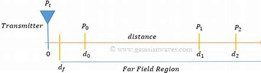
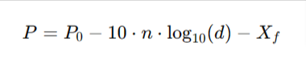

# Log-Distance Model

## Overview

The log-distance path loss model, is a model used in wireless communication systems to estimate the signal strength fading over distance.

This model says that when a signal travels a certain distance, its power gets weaker. It's like starting with a certain amount of energy, and as you go further away, you lose some of that energy. The rate at which you lose this energy follows a logarithmic pattern, meaning it decreases gradually, not linearly. The exponent, represented by 'n', controls how fast the signal weakens with distance. Additionally, variance helps account for random fluctuations or obstacles in the environment that can further weaken the signal, like shadows from buildings or walls.

### Equation

The log-distance model is defined by the equation:

where:

-   **P** is the received signal strength indicator (in dBm).
-   **P_0** is the RSSI at a reference distance **d_0** (in dBm).
-   **d** is the distance between the transmitter and receiver.
-   **d_0** is the reference distance (usually 1 meter).
-   **n** is the path loss exponent, representing how quickly the signal strength attenuates with distance.
-   **X** is the variance, representing the variability in RSSI measurements due to environmental factors such as obstacles, reflections, and interference.

 
 
 
due the indoor environments has many variables and obstacles is the relation between the power and distance will be non linear

