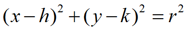
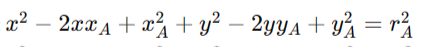
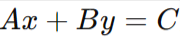
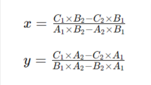

# Problem

You have three beacons and their distances to your device, and you want to calculate the device's position.

# solution

Suppose we have three circles, which centers are the positions of the beacons. The radius equals the distances to the beacons. Let the circles be denoted as A, B, and C.

To find the device's position, we need to find the intersection point(s) of these circles. This is known as trilateration, and it can be solved using various mathematical techniques, I will use elimination method

Each circle's formula would look like this:

So we will **expand each equaiton**:

I use three beacons do i have **3 equation** which i will solve them with **elimination** method, i will solve second with first and so on the third with one.

After solve them i will have 2 eqaution but i need to deal with those in development phase:

i should deal with those as variable so i simplify it as more as possible which we can convert it to **Linear equation**

finally we can derive this math principle

